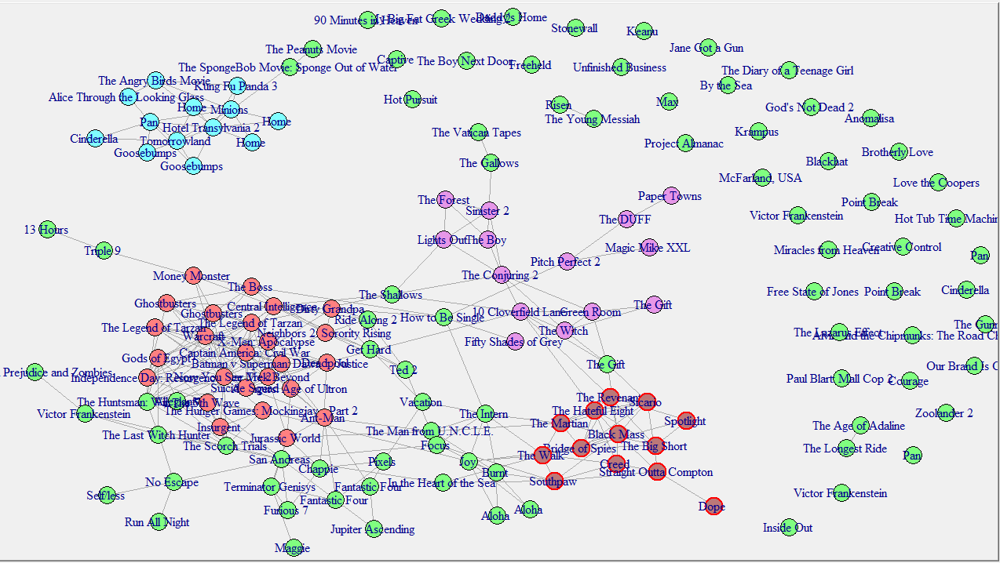
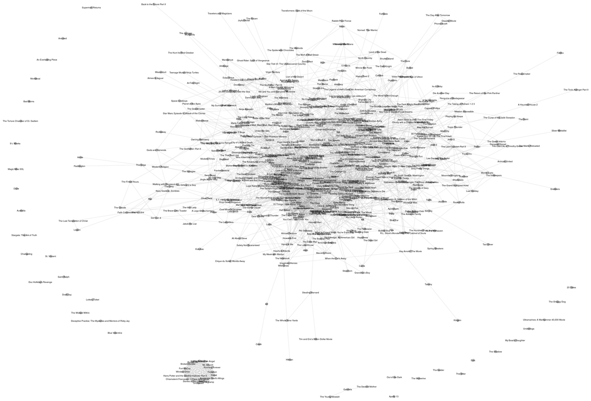
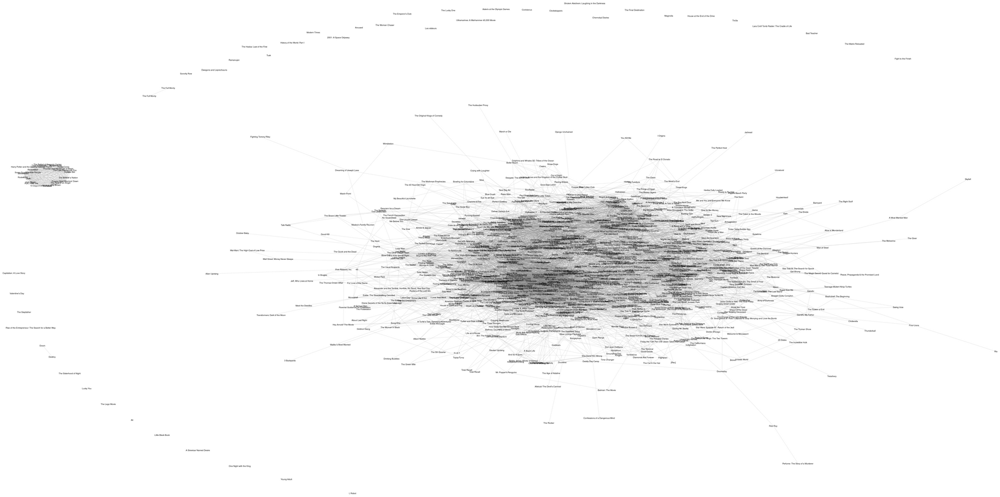

  

    <h2>Where the connections started to mean something</h2>
    
This is the project where Sam Castillo found his way into neural networks and large language models. It did not start as a model. It started as a drawing of movies.

    
On an IMDB title page there is a short list: people who liked this also liked twelve other films. Sam took a Kaggle table of about 5,000 movies, followed those lists, and drew a line whenever one film recommended another. A movie stopped being only a row of year, budget, and score. It became a point with neighbors.

    
Keywords make the same kind of picture from the other direction. Two films can sit close because they share plot words, even when neither page names the other. Recommendations and keywords are both ways of saying that a film is partly made of the films around it.

    
That is the click. A neural network and a language model also keep meaning in the links: a word, a sentence, or a film is a position among other positions, not a sealed box. The later math is heavier. The idea was already here, in a homemade map of who points to whom.

  

  <aside class="sw-find">
    <h2>What the picture is</h2>
    <ul>
      <li><strong>A point</strong> One film from the IMDB table.</li>
      <li><strong>A line</strong> One title shows up on the other’s “people who liked this also liked” list.</li>
      <li><strong>A color</strong> The first genre listed for that film.</li>
      <li><strong>A matrix</strong> The entry is 1 when two films are tied, and 0 when they are not.</li>
      <li><strong>The notes</strong> <a href="IMDB_network_final.pdf">IMDB_network_final.pdf</a> and the R Markdown beside it.</li>
    </ul>
  </aside>

## The drawings

These are the network files already in the repository. The PNG is embedded as it was saved. The two TIFF drawings live in <a href="larger%20networks.7z"><code>larger networks.7z</code></a> (<code>big_network.tiff</code>, 5330×3740, and <code>Rplot03.tiff</code>, 10000×5000). Browsers do not show TIFF, so each one is also here as a trimmed PNG and WebP. The archive is still the original.

<figure>
  
  <figcaption>
    <code>Network_genre_cluster.png</code>. Films are the points and IMDB recommendations are the lines. Color follows the first genre on the title, the same coding as the R notes. Labels on the drawing include titles such as Jane Got a Gun, Alice Through the Looking Glass, and Hotel Transylvania 2.
    <a href="Network_genre_cluster.png">Open the PNG</a>.
  </figcaption>
</figure>

<figure>
  <picture>
    <source srcset="assets/figures/big_network.webp" type="image/webp">
    
  </picture>
  <figcaption>
    <code>big_network.tiff</code>, drawn large and kept in grayscale: white page, gray links, black points. The file above is a trimmed copy at 1600 pixels wide so the page can show it.
    <a href="assets/figures/big_network.png">PNG</a>,
    <a href="assets/figures/big_network.webp">WebP</a>,
    original in <a href="larger%20networks.7z">larger networks.7z</a>.
  </figcaption>
</figure>

<figure>
  <picture>
    <source srcset="assets/figures/Rplot03.webp" type="image/webp">
    
  </picture>
  <figcaption>
    <code>Rplot03.tiff</code>, an R plot of the same kind of network, 10000 by 5000 pixels, also grayscale. The page shows a trimmed copy. The TIFF itself stays in the archive.
    <a href="assets/figures/Rplot03.png">PNG</a>,
    <a href="assets/figures/Rplot03.webp">WebP</a>,
    original in <a href="larger%20networks.7z">larger networks.7z</a>.
  </figcaption>
</figure>

## How a recommendation becomes a line

The notes in <code>IMDB_network_final.Rmd</code> walk through one film at a time. For a title such as <a href="http://www.imdb.com/title/tt0111161/">The Shawshank Redemption</a>, the page is read, the twelve recommended links are kept, and each link is checked against the films still in the table. That check fills one row of an adjacency matrix. The <code>network</code> package turns the matrix into an undirected graph, and <code>ggnet2</code> draws it. When there are more than nine genres, the plot keeps the nine that show up most often: Action, Adventure, Animation, Comedy, Crime, Drama, Fantasy, Horror, and Biography.

<ul>
  <li><strong>After 2016.</strong> A first slice of US films, small enough that the titles still fit on the drawing. The notes start here to see whether linked films form a pattern.</li>
  <li><strong>1970 to 1980.</strong> A sparser map. The open question in the notes: if each film points at twelve others, which of those twelve are actually in this set?</li>
  <li><strong>Before 1975.</strong> Fewer lines. Films from the same years sit nearer each other, and so do sequels.</li>
  <li><strong>The denser cut.</strong> The notes title this one “Movies from 2010–2014.” The code keeps US films with a release year after 2005 and before 2008, drops the titles because there are too many to read, and asks whether the points group by genre.</li>
</ul>

The full write-up, including those four drawings, is <a href="IMDB_network_final.pdf">IMDB_network_final.pdf</a>. The table those links were scraped from is the <a href="https://www.kaggle.com/deepmatrix/imdb-5000-movie-dataset">IMDB 5000 movie dataset on Kaggle</a>.

  <a class="sw-btn sw-btn-live" href="IMDB_network_final.pdf">Read the notes (PDF)</a>
  <a class="sw-btn sw-btn-source" href="https://github.com/sdcastillo/IMDB-Movie-Network-Analysis">Source</a>
  <a class="sw-btn sw-btn-source" href="larger%20networks.7z">Original TIFFs (.7z)</a>

